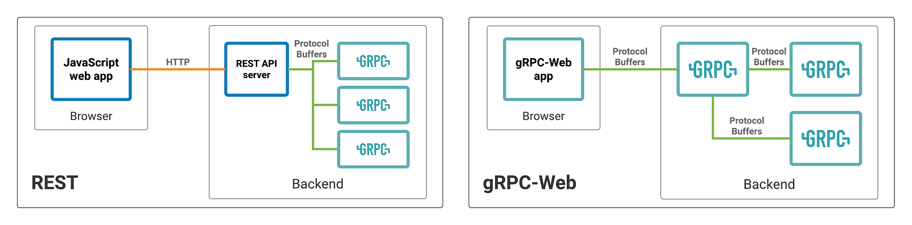

## 2. Create data from API *(OPTIONAL)*

API from <https://dummyjson.com/users>

- Your project must use Typescript, Typescript module, and HTTP framework (GRPC is plus)
- Tranforms JSON data from API to new data groupBy department
- We encourage you to write tests, which we will give you some extra score
- We will give you an extra score if you focus on performance.

--- sample response ---

```json
    {
        [Department]: {
            "male": 1,                      // ---> Male Count Summary
            "female": 1,                    // ---> Female Count Summary
            "ageRange": "XX-XX",            // ---> Range
            "hair": {                       // ---> "Color": Color Summary
                "Black": 1,                
                "Blond": 1,
                "Chestnut": 1,
                "Brown": 1
            },
            "addressUser": {                // ---> "firstNamelastName": postalCode
                "TerryMedhurst": "XXXXX",
            }
        }
    }, 
    ...
```

#

### Thought Process

This is my first time implementing gRPC in any language. I’ve seen many videos on implementing gRPC with Golang for handling microservices, but rarely with TypeScript.

Implementing the server itself is not very difficult. I’d say the most challenging part is configuring and setting up the environment to generate stubs from the protobuf definitions.

At first, I tried using `grpc-web` to connect directly from the client (React) to the gRPC server. However, I encountered many issues in doing so. The standard approach is to use Envoy as a proxy between the gRPC server and client. I managed to set this up, and the server worked fine. But when I tried using the client connection generated from my protobuf definition, I encountered numerous type-related errors. After spending some time investigating, I concluded that TypeScript is not fully supported with `grpc-web`, despite following their instructions closely.


> grpc-web with envoy proxy


> Two Different Approach

As a result, I tried a different approach instead of `grpc-web` and ended up implementing an Express server as a gateway between my gRPC server and React client. This setup works well.

I optimized performance by caching on the server, which improved response times by 98.6% (from 700ms to 10ms).

### How to run
```
# 2-create-data-from-api/server
npm start
npm run start:client

# 2-create-data-from-api/client
npm run dev
```
